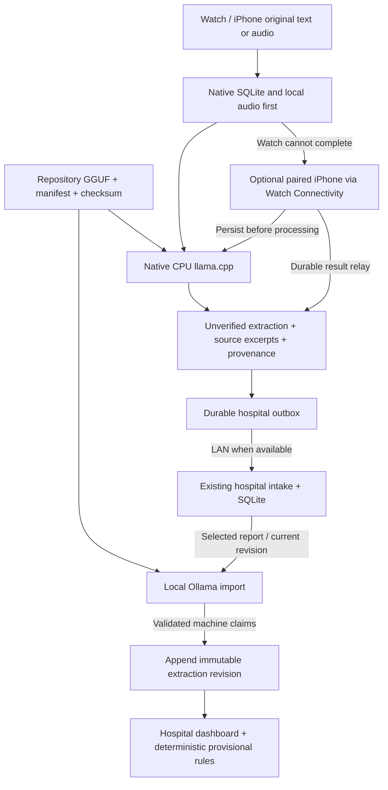

# Qwen3-0.6B integration — 2026-10-09

Historical integration evidence. For current provisioning, credentials, readiness,
validation and remaining blockers see [the 2026-10-10 connectivity report](global-ai-connectivity.md).
The setup instructions below describe the earlier manual import workflow.

Qwen performs real local text generation. It extracts **unverified claims**, never
clinical urgency, diagnosis or death. Existing deterministic provisional rules and
qualified verification remain authoritative. Saving or relaying a report has no
mandatory clinical approval gate. Original speech/text is never generated or replaced
by Qwen. Capture is persisted before inference or transport.

## Audit and architecture

See [pre-change audit](QWEN_AUDIT.md). Existing `watch/` and `hub/` stay in place.
The hospital remains an Express/SQLite modular monolith with a plain HTML dashboard.
Native SwiftUI apps share `watch/apple`'s Swift library and a vendored CPU llama.cpp
runtime. The Flutter/Wear OS prototype and its optional cloud sync remain intact.
No Supabase dependency is added to Qwen or Apple apps.



Typed Watch reports attempt Watch inference first. Memory/loading/context/timeout
errors retain captures; paired-iPhone transfer is optional and retried on activation.
Watch audio is recorded locally and transferred to iPhone: **offline Watch speech
recognition is not implemented**. The watchOS SDK has no Speech.framework. iPhone
uses the existing `OnDeviceTranscriber` with `requiresOnDeviceRecognition = true`;
it refuses unavailable locales and retains audio. Physical speech and connectivity
execution are unverified. Qwen is a text LLM, not speech recognition.

## Model and runtime pins

- Source: official [Qwen/Qwen3-0.6B](https://huggingface.co/Qwen/Qwen3-0.6B).
- Quantized conversion: [Unsloth Q4_K_M](https://huggingface.co/unsloth/Qwen3-0.6B-GGUF/tree/50968a4468ef4233ed78cd7c3de230dd1d61a56b), revision `50968a4468ef4233ed78cd7c3de230dd1d61a56b`.
  This is an official-source model converted by Unsloth, not an official Qwen GGUF release.
- `models/qwen3-0.6b/qwen3-0.6b-q4_k_m.gguf`: **396,705,472 bytes**.
- SHA-256: `ac2d97712095a558e31573f62f466a3f9d93990898b0ec79d7c974c1780d524a`.
- GGUF includes tokenizer vocabulary, special tokens, model metadata and chat template.
  The upstream `config.json` is retained separately; unused Transformers weights/vocab
  are not duplicated. `manifest.json` pins the config and conversion revisions.
- License: Apache-2.0, full source `LICENSE` and attribution in the model directory.
- llama.cpp: b6500 / `a7a98e0fffed794396b3fbad4dcdbbc184963645`, MIT.
  Vendored core source is local. `vendor/llama.cpp/VANGUARD.md` records the source
  archive hash, omitted non-runtime assets and the narrow watchOS compatibility patch.
- Ollama: 0.11.4; Docker manifest digest is pinned in both Compose configurations.
  `Modelfile` imports only the local GGUF, with explicit Qwen ChatML/non-thinking
  formatting and stop tokens. Startup never calls `ollama pull`.

## Reproducible initial setup

Prepare dependencies while internet is available. Actual weights, not LFS pointers,
must exist before builds or inference. Runtime is entirely local after preparation.

```sh
git clone https://github.com/yoshimendokusee/Vanguard.git
cd Vanguard
git lfs install --local
git lfs pull --include='models/**/*.gguf'
# Install Node 22+, Git LFS, Ollama 0.11.4, Docker/Compose separately.
# Apple: install Xcode with iOS/watchOS SDKs and CMake.
ollama serve                 # separate terminal; binds localhost by default
./scripts/qwen-setup.sh      # checks weights, imports qwen3:0.6b
./scripts/qwen-echo.sh
cd hub && npm ci && npm test
```

`qwen-setup.sh` is the explicit model-fetch step. It stops for missing/corrupt weights;
there is no automatic Hugging Face fallback during inference. In a clone without LFS
objects, retrieval must complete before the application is packaged. Native and hub
integrity checks reject pointer files and wrong checksums.

## Hospital/Docker

```sh
# Online preparation; existing hub build context remains hub/.
docker pull ollama/ollama:0.11.4@sha256:be17b353bf3cfab0b6980530284e64716a57589ed753a82d9a6a2a5fa9a61a31
docker compose build hub
docker compose up -d --no-build --pull never
# Equivalent existing entry point:
# docker compose -f hub/docker-compose.yml up -d --no-build --pull never
```

Both entry points retain `hub/data:/data`. Run only one at a time. The GGUF is
mounted read-only. A separate named Ollama volume holds the locally imported blob;
its entrypoint verifies SHA-256 and imports on every restart. Import is idempotent
and requires no internet. Ollama joins only an internal Compose network and exposes
no host port; the hub joins that network plus the ordinary application network.
The dashboard is served by the hub and never talks directly to Ollama.

For native Node, `OLLAMA_URL=http://127.0.0.1:11434` and the default artifact path
is repository-relative. Docker uses `http://ollama:11434` and `/models/qwen3-0.6b`.
Only loopback/private literal IPs and the documented local runtime hostnames are
accepted. Explicit `OLLAMA_MODEL` values must match the pinned `qwen3:0.6b`.

`GET /api/ai/status` retains its inexpensive exact-tag check; it does not prove
execution. **`GET /api/ai/health`** validates local weights, checks the imported
blob SHA and `qwen3` architecture through `/api/show`, then generates fresh tokens.
It returns 200 `status: ready`, `runtime: ollama`, `model_loaded: true`,
`inference_available: true` only on actual completion; otherwise 503 and an error.

Open an existing report's **Evidence and corrections** dialog and choose
**Extract this report with Qwen**. `POST /api/triage/:id/ai-extract` takes a UUID
`requestId` and current `baseRevision`, reads the current persisted transcript,
then appends an extraction revision through the existing storage transaction.
Same-request retries are idempotent; a concurrent correction returns 409 and
refuses stale extraction. Failures retain the original and previous history.
Explicit report/encounter linkage is preserved; names never merge records.

The separate free-text preview still supports extraction/triage-assist. Saving
its draft preserves the entire transcript, processing and provenance, rejects a
changed transcript, retains retry identity and starts source priority at Unassessed.
The old manual review checkbox and transcript truncation are removed. Generated
observations cannot be turned into clinician evidence by editing dropdowns.
Machine claims remain unverified in the hospital rules even when excerpts match.

## Apple builds and native runtime

```sh
./scripts/qwen-native-build.sh
open watch/apple/Vanguard.xcodeproj
# Xcode schemes: VanguardPhone and VanguardWatch
# Choose a signing team in Xcode for physical installations.
xcrun swift test --package-path watch/apple
```

The initial native build prepares a local XCFramework inside ignored `.native/`
from the vendored source: arm64 macOS/iPhone/iOS simulator/Watch simulator and
arm64_32 Watch device. No external Swift dependency resolves at runtime. The app
resource folder packages the verified repository GGUF and manifest. Intel simulator
slices are not included. Preserve old built frameworks until replacement slices succeed.

`QwenEngine` caches one model/context and serializes generation on an actor, outside
the UI thread. CPU-only configuration: Watch context 1024/thread 1; iPhone/macOS
context 2048/up to 4 threads; prompt decode batches 64; greedy sampling; bounded
output and a default 60-second generation deadline. Watch and iOS physical apps
check available process memory before load; simulators cannot validate that budget.
Cancellation/deadline checks occur between decode batches/tokens. A synchronous
model load or decode batch cannot be preempted by Swift cancellation; OS jetsam
can terminate an app before graceful recovery. Original inputs remain durable.

`NativeStore` uses a separate `vanguard-native.sqlite` in each app sandbox. Its
transactional schema v1 preserves immutable capture/audio links, original speech,
unverified processing and explicit LAN receipts. Local capture timestamps are
monotonic against persisted data inside a write transaction. Reopening retains
pending inputs. Only ACK IDs scoped to a transmitted report advance receipt state.
Nothing deletes audio, originals or queues. New local files follow the native
migration ownership in `database/migrations/README.md`; existing hub/watch applied
migrations are unchanged.

Watch Connectivity accepts bounded typed jobs or audio files, durably copies audio
before the receive callback ends, validates identity and stores before processing.
The iPhone preserves its original on-device speech transcription in SQLite before
Qwen. Results are persisted and queued for return; Watch validates that original
text matches its capture before completing. Activation/foreground recovery retries
pending jobs and retained iPhone results. Interrupted/background/physical transfer
behavior remains a hardware acceptance item; no continuous connectivity guarantee.

## Echo, platform and offline checks

```sh
./scripts/qwen-echo.sh
# Choose actual available simulator UDIDs using xcrun simctl list devices.
./scripts/qwen-apple-smoke.sh ios <iphone-simulator-udid>
./scripts/qwen-apple-smoke.sh watchos <watch-simulator-udid>
QWEN_TEST_HUB_URL=http://127.0.0.1:<isolated-test-port> \
  QWEN_IOS_SIM=<iphone-udid> QWEN_WATCH_SIM=<watch-udid> ./scripts/qwen-verify.sh

# Prepare isolated acceptance image while online:
docker build -t vanguard-qwen-qa:local hub
./scripts/qwen-offline-test.sh
```

The echo test validates weights and imported model identity, requires completed
nonempty generated tokens and measures latency. The marker is reported separately:
exact wording alone does not establish model identity. An absent runtime fails;
start local `ollama serve` and run setup first. Scripts never replace generation
with an echoed marker or treat mocked contract fixtures as inference.

Apple smoke installs/launches the actual production app in each simulator, uses
its own native engine, and requires a **fresh** completion artifact with generated
tokens, original preservation and SQLite persistence. `hardwareVerified: false`
is explicit. `qwen-verify.sh` exits 1 for failed checks and 2 for blocked coverage.
It never turns unprovided simulator/device evidence into PASS.

Offline Docker acceptance uses `qa/qwen-offline.compose.yaml`, fresh synthetic named
volumes, no `hub/data` mount, no builds/pulls and an internal-only network. It
independently checks real external egress denial, executes actual health/generation
and persisted extraction, restarts both containers and compares persisted rows.
It stops the test containers and **retains** their named volumes; no database reset.
Its exit 2 means Docker checks passed but physical-device/offline-LAN acceptance
remains blocked. It does not disconnect the user's host internet or alter their
network settings. The ordinary Compose configuration permits local LAN dashboard
access while isolating Ollama.

## Performed verification and measurements

Performed on 2026-10-09, macOS arm64, Xcode 27.0 / SDK 27.0; simulator runtimes
26.5. Only synthetic inputs and isolated databases were used. The real model was
retrieved and checksum-verified; generated text is not a fixture.

| Check | Observed result |
| --- | --- |
| Repository GGUF bytes/checksum | PASS, 396,705,472 bytes, pinned SHA-256 |
| Native Ollama 0.11.4 echo | PASS, `VANGUARD_QWEN_OK`, 9 actual tokens, warm request 1,795 ms, 78.4 tokens/s |
| Native Swift macOS generation | PASS, real CPU generation and persistence regression suite |
| iOS simulator app | PASS, 8 tokens, init 1.05 s, completion 1.16 s, 30.8 tokens/s, peak RSS 867,565,568 bytes |
| Watch simulator app | PASS, 8 tokens, init 1.72 s, completion 4.24 s, 16.1 tokens/s, peak RSS 679,067,648 bytes |
| Watch device target compilation | PASS, watchOS SDK 27, arm64_32, unsigned build; execution unverified |
| Web app | PASS, real button-triggered extraction appended revision 3 after main integration; original, encounter, source excerpts and artifact provenance visible |
| Docker actual generation | PASS, local Ollama on internal-only network, pinned model |
| Docker offline/restart/persistence | PASS, external egress denied, fresh extraction stored, restart retained original/provenance |
| Physical iPhone/Watch execution and STT | BLOCKED, devices/signing/locale assets not available for this run |
| Watch Connectivity disconnect/reconnect | BLOCKED, no paired physical-device evidence |
| Battery/thermal/responsiveness benchmark | BLOCKED, simulator token throughput is not device evidence |

RSS is process high-water usage, not model-only allocation. Simulator memory is
host-backed and **cannot** establish Watch feasibility. Q4_K_M file size alone is
~378 MiB; contexts/runtime/UI use additional memory. A physical Watch may refuse
loading or be terminated; the iPhone path and durable recovery remain essential.
These are single synthetic observations, not clinical validation or calibrated
performance benchmarks. No faster quantization/model swap was introduced without
measurement. Browser-native inference is not implemented; it runs on the local server.

Regression coverage uses clearly labeled fixtures for missing/corrupt artifacts,
wrong runtime identity, zero/incomplete tokens, invalid input, timeouts, concurrent
correction/extraction, retry deduplication, immutable originals, SQLite reopen,
clock rollback, embedded NUL text and cancellation. Existing populated hub/watch
upgrade tests remain. Hardware OOM/thermal/Watch Connectivity behavior and actual
speech accuracy are not simulated into passing evidence.

Final command counts, offline-native execution and PR/CI evidence are recorded in
[verification results](QWEN_RESULTS.md). Hosted CI remains separate from local checks.

## Troubleshooting and limits

- Missing/pointer GGUF: complete explicit Git LFS setup. A checksum failure stops
  inference; retrieve the pinned object again during setup, never reset storage.
- Wrong Ollama model: run local setup/import. A similarly named model does not pass
  the blob identity check. A tags-only status can be available while health fails.
- Native package reports missing XCFramework: build native slices first. Xcode
  linker failures on Intel require an additional tested simulator architecture.
- Input exceeds native context: retain original and use the paired iPhone where
  possible; no silent truncation or cloud fallback. Very long phone reports also
  remain pending rather than losing original text.
- Offline iPhone speech unavailable: provision the supported on-device locale using
  Apple setup while online and validate on the target phone. Original audio remains.
- Database or relay failure: original capture/history stays durable. Retry pending
  work after app activation; hospital receipt is distinct from relay receipt and
  clinical verification. Physical background delivery is not guaranteed.
- Existing prototype storage/LAN APIs remain unencrypted/unauthenticated. No real
  patient deployment, cloud inference, BLE relay or remote settings change is made.
