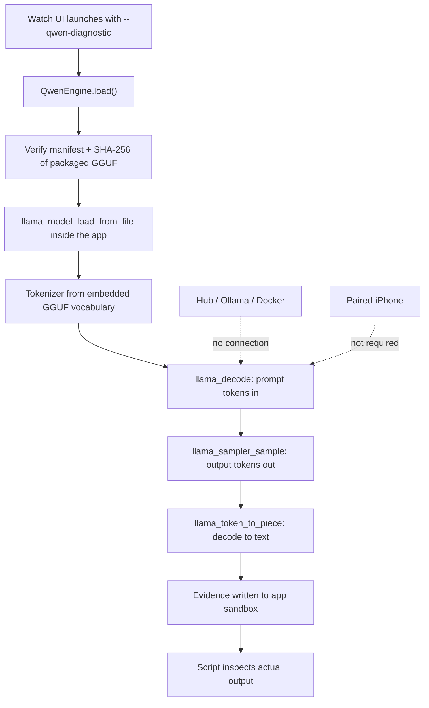

# Watch Qwen simulator verification

Observed on 2026-10-10 on macOS arm64, branch `Ticket/Test-qwen`. Every check
below was executed for this report. Only synthetic prompts were used; no patient
record, hospital database or real fixture was opened.

## Environment

| Item | Observed |
| --- | --- |
| Xcode | 27.0 (Build 27A266a) |
| Apple Watch simulator | Apple Watch Series 11 (46mm), UDID `B4D86609-C431-4218-B622-CC7B26668570` |
| watchOS runtime | 26.5 (26.5 - 23T570) |
| Model | `models/qwen3-0.6b/qwen3-0.6b-q4_k_m.gguf`, 396,705,472 bytes, SHA-256 `ac2d97712095a558e31573f62f466a3f9d93990898b0ec79d7c974c1780d524a` |
| Runtime | vendored llama.cpp b6500 CPU, `watchos-arm64-simulator` XCFramework slice |

## Architecture findings

Qwen runs **inside the VanguardWatch app process**. The pipeline is complete and
contains no remote hop:



Evidence that this is genuinely local, not proxied:

- The model path in the log resolves inside the installed app bundle:
  `.../VanguardWatch.app/qwen3-0.6b/qwen3-0.6b-q4_k_m.gguf`.
- The process name in the log is `VanguardWatch`, the app's own pid.
- The GGUF resource is a build-phase resource of the `VanguardWatch` target, and a
  `Verify pinned Qwen` build phase checks the SHA-256 before compilation finishes.
- `NativeWorkflow.process` calls `engine.generate` directly. The only HTTP client
  in the app (`NativeWorkflow.sync`, `HubEndpoint`) is used for hospital report
  relay, never for inference. No Ollama client exists in the Swift code.
- `QwenEngine` has no URL, socket or networking type anywhere in it.

Classification: **case 1 — Qwen running locally in the watchOS application process.**

## Model initialization

Actual log from the Watch process:

```
[VANGUARD_QWEN_WATCH] Initializing model
[VANGUARD_QWEN_WATCH] Model path resolved: /Users/.../VanguardWatch.app/qwen3-0.6b/qwen3-0.6b-q4_k_m.gguf
[VANGUARD_QWEN_WATCH] Loading model weights: Qwen3-0.6B qwen3-0.6b-q4_k_m.gguf 396705472 bytes
[VANGUARD_QWEN_WATCH] Model loaded in 0.560s
[VANGUARD_QWEN_WATCH] Tokenizer initialized from embedded GGUF vocabulary (151936 tokens)
```

Model located, initialized and tokenizer initialized all verified from the app's
own output rather than from a UI label.

## Inference results

Seven real requests, run `0f1e6c9e-35af-4a4d-8081-604b0e757f42`:

| Case | Prompt | Actual output | In / out tokens | Duration |
| --- | --- | --- | --- | --- |
| echo | Reply exactly: VANGUARD_QWEN_READY | `VANGUARD_QWEN_READY` | 53 / 8 | 0.912s |
| basic-reasoning | What is 2 plus 3? Reply with one number. | `2 + 3 = 5` | 53 / 7 | 0.855s |
| filipino-understanding | Isalin sa English: Masakit ang ulo ko. | `"Masakit ang ulo ko."` | 53 / 8 | 0.872s |
| english-understanding | Translate 'I feel dizzy' into Filipino. | `"Siya nangangangkikot"` | 50 / 11 | 0.894s |
| healthcare-terminology | What does BPM stand for in heart-rate monitoring? | `BPM stands for **Beats Per Minute** in heart-rate monitoring. It measures how many heartbeats occur in a minute...` | 50 / 37 | 1.452s |
| semantic-generation | Complete this sentence with one word: The organ that pumps blood is the | `heart.` | 56 / 2 | 0.785s |
| unique-echo-`0f1e6c9e` | Echo verification. Reply with exactly this text: VANGUARD_WATCH_QWEN_TEST_OK_`0f1e6c9e` | `VANGUARD_WATCH_QWEN_TEST_OK_0f1e6c9e` | 58 / 19 | 1.184s |

Notes on the two cases designed to rule out fakery:

- **Unique-run echo.** The marker embeds the run UUID, which is regenerated every
  launch. Repeating the exact marker string proves the model generated this run's
  text rather than replaying a stored or hardcoded answer.
- **Semantic generation.** The prompt deliberately never contains the word
  "heart". The model produced it, so it completed the sentence rather than
  echoing input.

The translation cases are weak outputs. `Siya nangangangkikot` is not a good
Filipino rendering of "I feel dizzy" (it means something like "he/she is
trembling"), and the Filipino-to-English case repeated its input. These are
recorded as observed, not corrected or smoothed over; they show the model runs,
not that its language quality is adequate.

## Terminal verification

| Command | Result |
| --- | --- |
| `bash scripts/test-watch-qwen.sh` | exit **0** — `PASS — QWEN EXECUTED IN WATCH SIMULATOR`, all 18 checked conditions PASS |
| `VANGUARD_LIVE_MODEL_DIR=<repo model> xcrun swift test --package-path watch/apple` | exit **0** — 22 tests, 0 failures, 0 skipped, including 6 real native inferences and a restart reinitialization |
| `xcodebuild -scheme VanguardWatch -destination 'generic/platform=watchOS Simulator' CODE_SIGNING_ALLOWED=NO build` | exit **0** — `** BUILD SUCCEEDED **` |

Script exit codes are real: the script returns 1 when any checked condition fails
and 2 on an environmental blocker. It failed with `FAIL` on earlier runs of this
work while its own bugs were being fixed, and only returns 0 now.

## Offline verification

Tested by stopping inference-capable services and rerunning the full battery cold,
then confirming the containers came back:

- `docker compose -p hub stop` and `docker compose -p vanguard stop`, plus stopping
  Mac Ollama. Confirmed no hub answered `/api/ai/health` and Ollama did not answer
  `/api/tags`.
- Cold relaunch of the Watch app with those services down: **7 requests generated
  tokens again** (run `a1d9e0eb-c80a-49d1-827d-b6fdc57dc5d1`). This is a second full
  378 MiB model load and decode, so it is not a warm-process artifact.
- Containers restarted afterwards and reported healthy: `vanguard-ollama-1`,
  `vanguard-hub-1`, `hub-ollama-1`, `hub-hub-1` all `Up ... (healthy)`.

Backend dependency: none. iPhone dependency: none. Internet dependency: the
inference path makes no network call, and `HUB_URL` is only read for hospital relay.

## Performance

Single run under normal host load, not a calibrated benchmark. Peak RSS is the
process high-water mark and includes model, context and UI.

| Metric | Observed |
| --- | --- |
| Model load (first, includes SHA-256 verify) | 0.560s |
| Model load, subsequent full run | 0.603s / 0.720s |
| Per-request inference | 0.785s – 1.452s |
| Tokens generated per request | 2 – 37 |
| Total for 7 requests | 7.812s |
| Peak RSS | ~1,020,739,584 bytes (≈974 MiB) |

## Failures

No checked condition failed in the final run. Honest limitations observed:

- **Filipino output quality** is poor on both translation directions (see table).
  Not a failure of inference; a capability limit worth tracking.
- **`english-understanding` output** `"Siya nangangangkikot"` is a mistranslation.
- The earlier `QWEN_RESULTS.md` reports higher watchOS tokens/s (39.90) than this
  run (~11.8 average). Host load differs between runs; no cross-run speed claim is
  made here.
- Physical-device behaviour is entirely unmeasured (below).

## Hardware limitations

Simulator success is **not** evidence that this runs on a physical Apple Watch.
This run used the simulator's arm64 slice with the Mac's memory available.

- `QwenEngine.load()` skips its `os_proc_available_memory()` budget check under
  `#if !targetEnvironment(simulator)`. On real hardware that guard becomes active,
  and a ~378 MiB model plus ~96 MiB context and UI against a Watch process memory
  budget can be refused or jetsammed. That path has never executed.
- Watch memory pressure, thermal throttling, battery drain, background suspension
  and cancellation during load are unmeasured.
- Watch offline speech recognition is still unimplemented, so spoken capture falls
  back to the paired iPhone. This test used text prompts and did not exercise it.
- No signing team, so no physical installation was attempted.

## Final classification

**PASS** — Qwen3-0.6B performed verified native inference inside the Apple Watch
Simulator application process.

Basis: the app loaded the pinned GGUF from its own bundle, initialized the
embedded tokenizer, decoded seven distinct prompts into generated text, produced a
correct unseen-word completion, repeated a per-run unique marker, generated tokens
again on a cold relaunch with the backend and Ollama stopped, and stayed alive
throughout. Physical Apple Watch compatibility remains **BLOCKED** pending
hardware evidence.

## Changes made for this verification

- `watch/apple/Sources/VanguardApple/QwenEngine.swift` — added `QwenDiagnosticLog`
  (`[VANGUARD_QWEN_WATCH]` pipeline events), `QwenDiagnostic` prompt list,
  `QwenEngine.processIdentity()`, and pipeline event/token-count logging. Added
  `inputTokens` to `QwenGeneration`. No inference behaviour changed.
- `watch/apple/Sources/VanguardApple/NativeWorkflow.swift` — added
  `runDiagnosticCases()` to drive real repeated inference.
- `watch/apple/App/VanguardApp.swift` — added `--qwen-diagnostic` mode that runs
  the battery and writes `qwen-diagnostic.json` evidence to the app sandbox.
  Existing capture, persistence and clinical paths untouched.
- `watch/apple/Tests/VanguardAppleTests/NativeTests.swift` — added coverage for the
  diagnostic case list, log hygiene, and a live run with restart reinitialization.
- `scripts/test-watch-qwen.sh` — new diagnostic script covering build, launch,
  inference inspection, offline isolation and cold relaunch.

No commit, push or PR was made.
