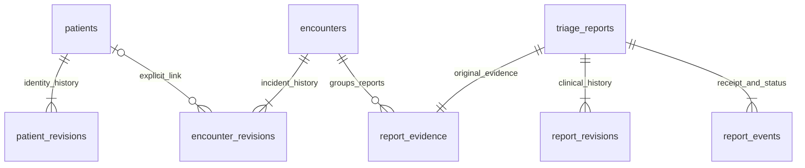

# Vanguard backend completion — 2026-10-09

The current `Backend` working tree implements a SQLite-backed LAN workflow with
structured evidence, explicit patient/encounter linkage, immutable corrections,
provisional assessment history and dashboard integration. It preserves the existing
modular monolith, applications, API fields and legacy LAN identity. This report
records checks performed for this request, not hosted CI or hardware acceptance.

## Git and preservation

- Started on clean `Backend` at `be7c938`, tracking `origin/Backend`.
- Fetched `origin/main` and rebased the existing feature commits onto
  `0f75c9066c9bae62fd97840f40a699830690d5c8`.
- Resolved conflicts in README, architecture/API documentation, watch SQLite and
  watch UI by combining Main's automatic retries, risk rules, Apple library and
  dashboard with Backend's migrations, cloud ownership and authentication UI.
  Updated the transport fixture for the combined row constructor.
- The initial conflict edit was incomplete; Flutter analysis caught it. Restored
  full files, corrected the rebased feature commit and verified both applications.
  The final rebased history contains complete files; `origin/main` is an ancestor.
- Existing feature commits were rewritten only for the requested rebase. New
  backend implementation edits remain uncommitted. No push, force-push, merge,
  remote settings change, deployment or PR creation was performed.
- Original history remains reachable at `be7c938`; two task safety stashes retain
  implementation snapshots. No pre-existing uncommitted work or patient databases
  were discarded. `hub/data` was never opened or mounted for these checks.
- A later fetch encountered transient DNS failure; the final retry succeeded and
  confirmed the same `origin/main` revision. No hosted CI result is claimed.

## Audit and completed execution paths

| Area | Before this work after combining branches | Current implementation |
| --- | --- | --- |
| Patient/encounter | Group reports only; no entity/history workflow | Explicit UUID records, unknown/reported identity, append-only snapshots, explicit report linkage; no name matching |
| Transcripts | Legacy originals retained; over 1,000 characters/processing refused | Exact originals up to 16,000 characters, immutable submission snapshot, source metadata and separate corrections |
| Findings | Tested processing validator disconnected from storage | Versioned processing, typed findings, excerpts, source type, unknowns/contradictions and provenance stored in intake/revision transactions |
| Triage | Prototype legacy rules computed on read; structured rules only a utility | Existing rules connected to validated evidence; persisted reason/version/inputs at every revision; stale extraction invalidated |
| Idempotency | Legacy uniqueness and field comparison | Original/processing/UUID/link/count-uncertainty comparison, per-request revision replay, stale-base conflicts, ambiguous ACK rejection |
| State/recovery | Watch pending flag, foreground retries and scoped ACKs | Preserved queue; longer byte-bounded batches, persisted timestamp ordering, atomic hub receipt/status events and revision history |
| SQLite | WAL, initial migration/adoption | Numbered v2 upgrade, backfill, foreign keys, FULL commits, lock timeout, immediate transactions, immutable evidence/history triggers |
| Express | Sync/list/status/SSE | Detail/history, patient/encounter create/read/revision, report correction/extraction/override, structured parser/database errors |
| Dashboard | Local static board with risk reasons | Reads persisted assessment, exposes history/corrections/override, preserves original text, displays uncertainty and excludes unknown counts/stale readiness inputs |
| Apple/iPhone | Native STT/recovery library ports; no complete apps | Preserved library; backend accepts its processing envelope once a real client supplies it; no invented native execution |
| Qwen | Handoff/contract only | Durable model provenance/claims accepted; no model/runtime or fabricated extraction added |
| Docker | Shared normal data paths and separate QA Compose | Both normal entry points preserved; image tests and restart/recreation checks use isolated synthetic storage |

Actual available flow:

```text
watch STT -> existing parser -> exact original + legacy report -> SQLite commit
  -> automatic foreground bounded LAN batch -> envelope/report/evidence validation
  -> one immediate SQLite intake transaction
     -> explicit/new unknown encounter
     -> immutable source + submission + structured processing
     -> provisional assessment revision + durable receipt event
  -> ACK only committed/identical reports -> client marks only scoped ACK IDs
  -> dashboard reads persisted latest assessment via one joined query
```

Correction/reassessment flow:

```text
request ID + base revision + actor + reason -> validate
  -> identical replay / conflict / fresh append
  -> corrected transcript invalidates stale extraction and operator override
  -> optional validated processing for that exact current transcript
  -> deterministic reassessment with version/reason/inputs -> immutable revision
  -> commit -> SSE/list refresh -> visible source, correction and history
```

Original `raw_text`, source category, injuries and timestamps never change. A
correction changes the current transcript snapshot. Findings and assessment
snapshots live together in each revision, preserving their source/provenance;
separate unused transcript/finding tables were not added. Status changes remain
reversible among inbound/arrived/cancelled and are atomically logged. Repeating the
same status creates no extra event. These operator states are distinct from receipt.

## Schema and relationships

Migration `hub/migrations/0002_clinical_history.sql` extends the original table:

| Table | Responsibility |
| --- | --- |
| `triage_reports` | Existing source report fields, integer hub ID, immutable `(watch_id, created_at)`, current operator status |
| `patients` | Explicit stable patient UUID and intake time |
| `patient_revisions` | Identity status/name and actor/reason/request/body history; unique patient/revision and patient/request |
| `encounters` | Stable encounter UUID and intake time |
| `encounter_revisions` | Nullable patient FK and incident snapshot history; unique encounter/revision and encounter/request |
| `report_evidence` | One report FK, encounter FK, optional unique source UUID, reported-count flag, immutable processing and exact submitted JSON |
| `report_revisions` | Report/revision PK, unique report/request, kind/actor/reason/body, current transcript/findings/provenance and assessment snapshots |
| `report_events` | Durable hub receipt and operator status-change history |



Foreign keys, enums, revision bounds, JSON validity and uniqueness are enforced in
SQLite; trust-boundary validation enforces bounded strings and supported clinical
values. History UPDATE/DELETE and source-field UPDATE are rejected by triggers.
Prepared SQL is used throughout. Indexed keys support history/encounter lookups.

Upgrade locks and version reads occur in the same transaction. Version 0 compatible
schemas are adopted, then v1 and v2 applied; populated v1 schemas upgrade directly.
Each legacy report receives one unknown encounter and immutable baseline assessment
without altering any original content/status/identity. Legacy count certainty is
unknown because defaults cannot prove that a count was explicitly supplied. Reopen
retains the exact encounter IDs and baseline assessments. Incompatible/newer schemas
or incomplete clinical history fail instead of resetting anything. See
`../database/migrations/README.md` for backup/recovery procedures.

## Algorithms and uncertainty

- Validation rejects malformed identifiers, impossible dates, unsupported enum
  values, invalid source excerpts, duplicate finding/local IDs and oversize input.
  Text is never silently truncated. UUID identities are normalized to lowercase.
- Legacy identity remains primary. Optional source UUIDs cannot be reused under a
  different legacy identity. Retries compare immutable originals and metadata;
  differences return rejection without ACK. No similarity-based patient merging.
- Structured triage reuses `assessRisk`/`provisional-v1`: abnormal/absent breathing,
  unresponsiveness or severe bleeding -> Immediate; inability to walk -> Delayed;
  Minor requires walking, alertness, normal breathing and absent severe bleeding;
  otherwise Unassessed. These are existing **prototype** rules, not a newly adopted
  clinical protocol. Legacy exact-finding rules and higher source urgency remain.
- A claimed non-unknown observation needs a matching source excerpt and reported/
  observed provenance without contradictions. Missing references, contradictions,
  model-inferred values and all machine extractions become unknown for assessment.
  Their original claims stay stored. Substring checks establish a reference, not
  semantic truth; qualified non-model reassessment is needed for machine claims.
- Intake/reassessment stores algorithm version, supporting observations, reason,
  computed priority, uncertainty and optional provisional operator override.
  Corrections clear stale extraction and overrides. Every result still requires
  qualified verification; there is no mandatory approval before submission.
- Dashboard ordering preserves inbound first, established effective priority,
  known ETA before unknown, expected arrival/creation time and a stable hub-ID tie
  break. No fabricated severity is assigned to unresolved findings.
- Watch legacy timestamps advance beyond the persisted maximum inside the write
  transaction, surviving restart/clock rollback. Queue state remains pending until
  validated scoped ACKs, with foreground retry/backoff and byte-aware batches.

## HTTP integration

Existing sync/list/status/health/config/SSE contracts remain. Additions are
`GET /api/triage/:id`, `POST /api/triage/:id/revisions`, and create/read/revision
endpoints for patients and encounters. Read `api-contract.md` for exact fields,
limits and error shapes. Revisions use stable request IDs and optimistic base
versions; identical retries are safe, changed request IDs/bodies or stale edits
cannot silently overwrite history. The browser keeps an unchanged edit's request
ID for retry and retains the edit on failure. Clinical corrections are never
browser-only state.

Pending -> committed hospital receipt -> client-observed ACK is the implemented
transport model; failed attempts retain pending data. The backend does not invent
client transmission events it cannot observe. A stored receipt means hub persistence,
not that the client received the response or that a trusted hospital identity/clinical
review was established. Arrival remains a separate operator action.

## Checks performed for this request

| Command/check | Observed result |
| --- | --- |
| `cd hub && npm ci && npm test` baseline | PASS, 21 tests after rebase combination |
| `cd watch && flutter pub get && flutter analyze && flutter test` baseline | Initial conflict edit failed analysis; corrected files passed, 21 tests |
| `cd hub && npm test` final | PASS, 32 tests |
| `cd watch && flutter analyze && flutter test` changed logic | PASS, no analysis issues, 23 tests |
| `node --test .github/scripts/validate-repository.test.js` | PASS, 6 tests |
| `node .github/scripts/validate-repository.js` | PASS |
| `git diff --check` | PASS |
| `dart format --output=none --set-exit-if-changed lib test` | PASS after formatting the inherited cloud service |
| Root and `hub/docker-compose.yml` Compose config, plus QA Compose config | PASS |
| `docker build -t vanguard-backend-qa:local hub` | PASS |
| Image `npm test` with `--network none`, `DB_PATH=:memory:` and read-only docs/watch mounts | PASS, 32 tests |
| Isolated named-volume HTTP QA | PASS: receipt, ordering, identical replay and conflicting original rejection |
| Real browser Evidence and corrections dialog | PASS: loaded history, saved exact synthetic correction, preserved original and prior risk |
| Container restart and recreation using isolated QA volume | PASS: original/corrected text, classification history and encounter IDs persisted |

Regression coverage includes structured intake through SQLite/list/detail APIs,
patient and encounter endpoints, uncertainty/contradiction/model claims, immutable
originals, optimistic corrections and reassessment history, override clearing,
ambiguous ACKs, long/multibyte batching, restart/clock rollback, idempotent intake,
transaction rollback after partial work, populated upgrades and failed upgrade
rollback, foreign keys, unique identities, concurrent writers, malformed/oversize
JSON, database failure without acknowledgment, unknown counts and stale readiness.
Fixtures are synthetic. Expected migration-failure tests print the synthetic SQL
failure; that is a passing rollback check, not an unhandled production error.

## Changed files

New: `hub/clinical.js`, `hub/records.js`, `hub/clinical.test.js`,
`hub/migrations/0002_clinical_history.sql`, and this report.

Updated: hub migration runner, ingest, processing validator, routes, dashboard,
risk/database/contract tests; watch parser, queue and sender plus transport/upgrade
tests and inherited cloud-service formatting; README, migration ownership guide, architecture/API documentation, and
historical database/Qwen/implementation handoffs. Watch UI changes belong to the
rebase combination, preserving automatic LAN and existing cloud functionality.
No new dependency, framework, application, service or transport was introduced.

## Remaining limits and decisions

- No complete Apple Watch/iPhone app, watchOS STT runtime, paired audio intake,
  production native SQLite adapter or Qwen runtime exists. The preserved Swift
  library's contracts do not prove device execution. Those platform/runtime decisions
  and target hardware evidence remain outside the available backend workflow.
- No clinically validated protocol, authenticated clinician workflow, trusted death
  confirmation, semantic model-grounding algorithm or final expanded clinical
  template is specified. Existing rules stay provisional; unsupported facts remain
  unknown. No treatment advice or new scoring threshold was invented.
- LAN HTTP, device/actor labels and SQLite storage remain unauthenticated/unencrypted;
  use synthetic isolated development only. Real patient use requires approved
  access controls and protected storage/transport. No hosted security claim is made.
- A four-hex-digit watch identity can still collide across devices. Content conflicts
  now remain pending rather than losing evidence. The requested legacy compatibility
  remains; a globally unique primary-identity migration was not performed.
- The board lists report groups, not a verified unique-patient census. Multiple
  explicitly linked reports preserve separate original records; use report revisions
  for reassessment. No undocumented patient/group merging algorithm was invented.
  Current watch parser count defaults are claimed source values, not clinical proof.
- Foreground retry is tested; suspended/background delivery, physical-device behavior,
  speech accuracy, cloud acceptance, BLE and Windows/browser hardware were not tested
  here. Existing Supabase behavior was preserved, without new cloud implementation.
- Original limits remain bounded at 16,000 UTF-16 code units and 1 MB HTTP bodies;
  longer local originals remain pending. API pagination, encrypted retention and
  authentication require separate requirements. Device clock skew still affects ETA.
- Hosted CI, native builds and remote publication were not run. The implementation
  is reviewable locally on the rebased branch; no PR/commit/push is implied.

QA cleanup: the task-only hospital container was stopped/removed after testing. Its
isolated synthetic volume `vanguard-backend-task-20261009-01` and local image remain
for recovery; normal Compose volumes/data paths were untouched. The visual proof is
saved outside the repository in the task visualization directory.

Legacy baseline assessments are explicitly attributed to `migration` at their
actual computation time; historical source/receipt timestamps remain unchanged.
The backfill does not imply a clinical assessment occurred when the old report
was received.
