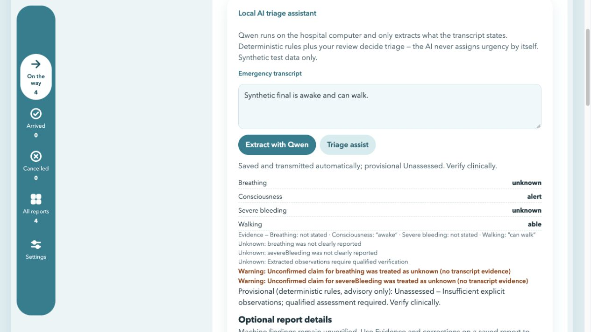

# Vanguard global AI connectivity — 2026-10-10

Software fixes and available validation are recorded here. **Full physical-device
acceptance remains incomplete.** No real Watch/iPhone, radio, speech or background
delivery verification is claimed. All inputs and test databases were synthetic.

## A. Root cause and evidence

The previous Docker startup verified the repository GGUF before importing it but
did not provision missing weights. A clone containing only the Git LFS pointer
therefore could not start its model. Reproducing that startup with a pointer-only
mount produced `qwen3-0.6b-q4_k_m.gguf: FAILED` and
`sha256sum: WARNING: 1 computed checksum did NOT match`, exit 1. An existing
developer's already-populated weights and Ollama volume could mask this dependency.
This is a reproduced fresh-clone failure, **not proof of the precise failure on the
teammate's machine**: that machine's logs and configuration were not supplied.

The Flutter clients also shared a fixed `192.168.8.10:3000` default; that address
could not identify every team's hospital. Physical devices' loopback addresses
identify the devices themselves. Vite's fixed WebSocket client port prevented
working HMR when the host port changed. Older availability indicators could infer
readiness from model tags rather than successful generation. These independent
transport, provisioning and readiness assumptions made one working setup inadequate
evidence for another platform or user.

Browser validation additionally found the new `api-client.js` asset was caught by
Vite's `/api` proxy. It is now `hub-client.js`, imported before dashboard execution;
the HMR acceptance also verifies that asset. Docker extraction initially timed out
at 60 seconds under concurrent load. The final default is two CPU threads and a
120-second inference deadline, with 130-second browser/Flutter deadlines. This
reduces oversubscription and permits the verified two-request scenario; it is not
a latency or arbitrary-load guarantee.

## B. Integrations repaired

| Area | Final integration |
| --- | --- |
| Web dashboard | Central same-origin `/api/*` requests, UUID correlation, bearer-aware events/polling, READY only after completed tokens, automatic original-first persistence and receipt-checked transmission |
| Express API | Versioned AI success/errors, validated runtime configuration, correlation headers including denied/malformed requests, retained existing record/revision/sync endpoints, authenticated correction actors |
| Docker Ollama | Initial pinned provisioning and atomic verification, import after successful provisioning, persistent weights/import volumes, isolated runtime network, bounded queue and CPU settings |
| iPhone/Watch | Native local Qwen remains independent; validated saved LAN origin, Keychain bearer token, separate local-AI/LAN states, automatic relay after processing and bounded foreground reconnect |
| Native relay | Central request creation, 8-second LAN timeout, bounded batch/body, exact ACK/counter validation, empty queue requires a real authenticated config response before reporting connected |
| Flutter prototype | Central explicit `HUB_URL`/`HUB_TOKEN`; removed personal IP default; READY and actual-inference checks; rejected crossed transcript processing; preserved existing storage and optional cloud paths |
| Shared contract | Version 1 canonical fixture decoded by JavaScript and Swift; original transcript, evidence, uncertainties and extraction provenance retained; UTF-16 request bounds match JavaScript |

Primary changed files are `hub/ai.js`, `server.js`, `access.js`,
`provision-model.js`, Compose/Vite configuration, `public/hub-client.js`,
`public/dashboard.js`, `watch/apple`'s contract/endpoint/workflow/engine/app,
Flutter AI/sync/config services, their regression tests, the canonical fixture,
setup/acceptance scripts and existing PR CI. No database migrations were rewritten; main's new cloud-backup migration and public Apple configuration are preserved,
and no application was relocated and no framework or service replaced Express/SQLite.

## C. Final architecture

| Platform | Inference | Persistence and transport |
| --- | --- | --- |
| Web | Browser → Vite same-origin proxy or Express production assets → Express → internal Docker Ollama → verified Qwen3-0.6B | Account/browser-scoped local outbox before inference; automatic Unassessed intake to existing Express/SQLite; only matching ACK removes local entry |
| iPhone | Packaged GGUF → native llama.cpp CPU, without HTTP/Docker/Watch dependency | Existing native SQLite original/processing/relay records → configured LAN hub, or existing Watch Connectivity fallback processing |
| Watch | Its own packaged GGUF → native llama.cpp CPU, without iPhone/Docker dependency for typed local extraction | Existing native SQLite first; configured LAN hub when reachable; durable paired-iPhone fallback for unsupported speech/failed local processing |

Qwen extracts unverified observations; deterministic provisional rules and qualified
clinical review remain authoritative. Automatic storage/transport has no mandatory
clinical approval gate. Original reports, corrections, patient/encounter links,
provenance, uncertainties and legacy deduplication remain compatible.

Readiness values are `INITIALIZING`, `MODEL_MISSING`, `MODEL_DOWNLOADING`,
`MODEL_LOADING`, `READY`, `UNAVAILABLE`, `ERROR`. Web READY requires pinned model
identity plus fresh completed tokens. Native READY requires successful native
generation. Local model readiness and LAN status are distinct: a hub failure never
marks a functioning native engine unavailable. A stale READY probe cannot promise
the next request's latency; errors still retain the original.

## D. Environment independence and setup

From a repository clone with Docker available:

```sh
docker compose up -d --build
```

`model-init` accepts verified checkout weights or downloads the manifest's pinned
revision when the file is absent/a pointer/corrupt. It enforces exact size, GGUF
header and SHA-256 before atomic installation. Imported weights and verified GGUF
use separate persistent volumes. `hub/data` keeps its existing bind path. Initial
setup needs internet for missing images/weights; Ollama inference has no internet
route and no published host Ollama port. Recreating containers preserves models and
reports. Do not delete volumes/data to recover.

`node scripts/connectivity-check.cjs` was run with a temporary copy of source,
pointer-only weights, empty model volumes/database, a unique Compose project and
random host ports. It passed actual import/generation, Vite proxy/HMR, concurrent
responses, duplicate-safe intake, runtime loss, recreation/retention and external
egress denial. It removes only its own disposable project. This is a fresh runtime
test on this host, not a test on every teammate's computer.

Native packaging uses:

```sh
./scripts/qwen-setup.sh --model-only
./scripts/qwen-native-build.sh
./scripts/whisper-watch-build.sh
open watch/apple/Vanguard.xcodeproj
```

Model-only setup requires Node but no host Ollama or Docker. Xcode build phases
verify the pinned GGUF before packaging. Existing native runtime build tools/SDK
requirements remain. Runtime source configuration contains no developer's home path;
absolute paths in validation commands identify this run's checkout only.

For LAN use, set `HUB_BIND_ADDRESS` (Docker) or `HOST` (native Node) and server-only
`HUB_USERS` credentials. Anonymous mode is restricted to loopback; an empty credential
array also fails LAN startup. Configure the Apple app with a hospital origin and its
assigned token/device identity. Flutter uses explicit build-time `HUB_URL`/`HUB_TOKEN`;
root `.env` does not configure it automatically. Web keeps same-origin API access;
`HUB_PORT` and `VITE_PORT` can change without source edits.

Manual configuration is the implemented discovery fallback. Prefer a hospital DNS
hostname or DHCP reservation, enter a new origin when the network changes, and retry.
Origins reject embedded credentials, paths, queries, wildcards and physical-device
loopback. No automatic Bonjour discovery, network-wide naming service or physical
LAN roaming has been verified. Bounded foreground retries do not promise delivery
while the OS suspends the app.

## E. Actual validation

| Check | Actual result |
| --- | --- |
| Hub locked install, tests and production Vite build | PASS; 68 unit/HTTP/contract/persistence/browser/cloud tests pass; one deliberate live-test skip in the unit run (69 total) |
| Flutter formatting, analysis and tests | PASS; 111 tests, no analysis issues |
| Native `xcrun swift test` with real model | PASS; 19 tests, no skips/failures; includes real tokens, contract decoding, durable storage and disconnected/invalid-ACK/reconnected hub tests |
| Native real generation with outbound networking denied | PASS; directly ran the compiled XCTest bundle under `sandbox-exec`; 9 tokens, 1.492 s completion, 709,033,984 bytes peak RSS |
| iPhone simulator | PASS on iPhone 17 Pro / iOS 26.5; 8 fresh marker tokens, 0.975 s initialization, 2.760 s completion, 1,000,964,096 bytes peak RSS; original/processing saved to SQLite |
| Watch simulator | PASS on Series 11 46 mm / watchOS 26.5; 8 fresh marker tokens, 1.145 s initialization, 1.525 s completion, 824,262,656 bytes peak RSS; original/processing saved to SQLite |
| iOS simulator build with embedded Watch | PASS after removing unsupported watchOS `textSelection` modifier |
| Unsigned physical SDK build | PASS for iPhone ARM64 and embedded Watch ARM64_32; compilation only, no installation/hardware execution |
| Both Compose entry points and repository policy checks | PASS; configuration, structure/environment consistency, shell/script syntax and whitespace checks |
| In-image tests, in-memory DB, networking disabled | PASS; 68 pass and one deliberate live-test skip (69 total) |
| Pointer-only fresh Docker acceptance | PASS; real Qwen, two concurrent requests, distinct correlation, shared processing contract, SQLite retention, HMR, restart and egress denial |
| macOS native generation plus actual isolated hub receipt | PASS in an earlier live run; synthetic native processing ingested and exact ACK cleared its outbox |
| Physical Watch/iPhone, paired radios, speech capture, suspension | NOT VERIFIED; no device evidence supplied; simulator/native-host measurements are not physical memory/latency budgets |

Failures encountered and their disposition:

- Baseline pointer-only startup failed checksum verification as reproduced above;
  automatic verified provisioning now passes.
- The custom Swiftly invocation rejected the package's tools-version declaration;
  the installed Xcode compiler (`xcrun swift`) builds/tests it successfully. The
  package declaration was preserved.
- A first test fixture assumed URLProtocol always exposed `httpBody` and crashed;
  it now correctly reads the body stream. Real contract tests pass.
- Running SwiftPM itself inside the outbound-denied sandbox failed because nested
  sandbox application was disallowed. Direct compiled XCTest execution succeeded;
  no blocked build is reported as an inference pass.
- Browser and concurrent Docker calls initially returned `ollama-timeout` at 60 s.
  Browser input was retained and automatically ingested as Unassessed without
  fabricated processing. The final two-thread/120 s fresh acceptance passes; slow
  CPUs or larger workloads can still timeout and must retain/retry originals.
- Adding request correlation fields exposed an older exact-error-shape test;
  error fixtures/assertions and callers were updated, and final tests pass.
- A separate upstream image-index inspection timed out resolving
  `registry-1.docker.io`. The pinned image was already present locally; the
  pointer-only test used fresh weights/import volumes, but an uncached registry
  pull was not independently verified on this host. GitHub's first hosted run
  subsequently passed the full Docker test with an uncached runner.

Watch voice processing now starts locally with a bundled Whisper tiny multilingual
model; Qwen remains text-only. A failed local run preserves audio and can use the
paired-iPhone fallback. The simulator's ~0.8–1 GB process
RSS does not establish feasibility on a physical Watch. iOS on-device speech
availability/permissions/language assets and background Watch Connectivity need
actual devices. HTTP transport and ordinary local storage are prototype protections,
not approved real-patient deployment. HTTPS termination and protected storage are
not provided by this change.

Final browser UI validation completed real extraction and automatic receipt, showing
`Saved and transmitted automatically; provisional Unassessed`. Unknown breathing
and bleeding remained unknown despite unsupported model claims.



Integration with updated main `0c6f1b5` preserved the cloud backup worker/migration,
public Apple Info.plist configuration, and stricter Flutter response validation.
Cloud status/sync and cloud SSE events use the authenticated central browser client.
A new stream regression preserves both triage and cloud events through bounded
reconnection. Native build-time hub configuration is a fallback behind saved pairing.

A post-integration fresh download initially failed with `fetch failed`; GitHub Git
and API requests also intermittently failed DNS/connection resolution. Existing
models and offline tests remained usable. This is recorded as a network-dependent
initial provisioning failure, not replaced by a cached-model success.

## F. Multi-user verification

The real Docker test submits two different transcripts concurrently and verifies
distinct UUIDs, exact originals and pinned provenance, then separately persists
their report/encounter IDs. Calls contain only that request's transcript and a
fixed system prompt: no shared chat history or continuation context exists.
Ollama serializes execution with a bounded eight-request waiting queue; overload
and deadlines return errors rather than mixing responses. No unlimited concurrency
or clinical latency guarantee is claimed.

Tests exercise simultaneous `WATCH-A`/`WATCH-B` credentials, deny device identity
spoofing and hospital-record/SSE access, reject anonymous records access, and keep
duplicate ACKs from creating extra rows. Operators intentionally share their
authorized hospital board; this is not a multi-hospital tenant system. Separate
hospitals use separate hubs/storage/credentials. Per-account browser outboxes and
one atomic key per report prevent captures from overwriting another session's queue.
Crossed AI originals/request IDs and invalid receipts are rejected. Failed or lost
receipts retain identity for safe replay. Existing populated-database/revision tests
continue to pass. Bearer identity is server-assigned, not a patient/device timestamp.

## G. Pull request and acceptance status

The feature branch is `feature/global-ai-connectivity`, originally based on main
`c1a2ce4` and then synchronized with main `0c6f1b5` after independent cloud/config
work landed. [Draft PR #16](https://github.com/yoshimendokusee/Vanguard/pull/16)
targets main and remains unmerged.

[Initial hosted CI](https://github.com/yoshimendokusee/Vanguard/actions/runs/37962492841)
passed all six checks on `46972ad`. It was manually dispatched after no automatic
run appeared for the conflicting PR. That pass does not validate the later
integration commit; current-head results are recorded in the delivered task report.
Existing review/ruleset configuration has not been weakened; required CI checks
retain their names. GitHub validation also runs the fresh real-model acceptance.

Full acceptance remains open for physical devices, autonomous Watch speech,
actual paired/background transport, teammate-environment diagnosis and deployment
transport/storage protections. Passing software checks does not close those gaps.
